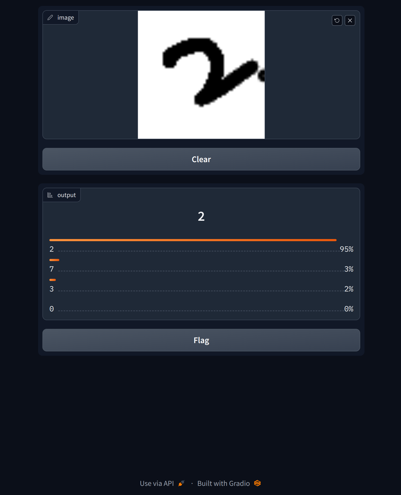

# gradio app ocr
make a gui app that classifies hand drawn digits, model trained on mnist digits dataset



- gradio 
- tensorflow
- keras (tensorflow.keras)

```
pip3 install tensorflow gradio
```

```
run app.py

# draw digits on site at: http://127.0.0.1:7860
```
